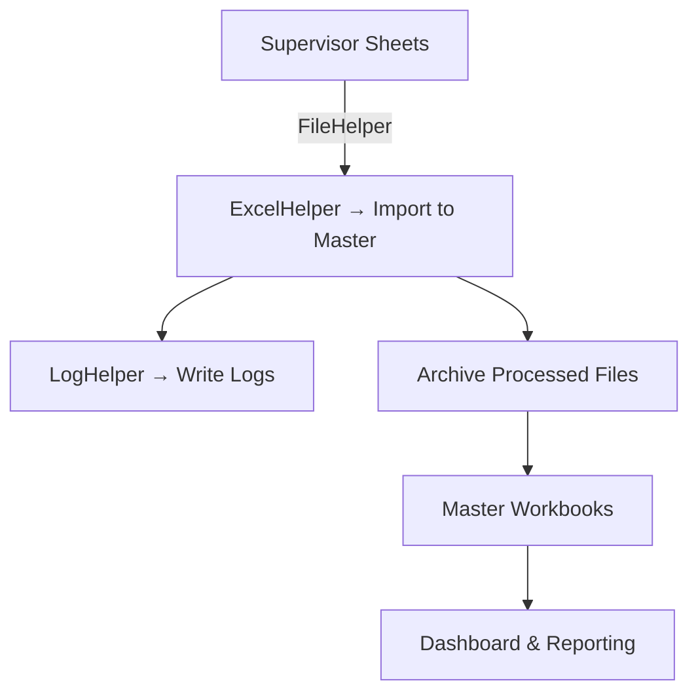

# Oakpark Yields & Efficiency Automation System

### Version 1.0  |  Author: Jordon Coady (IT Graduate – Oakpark Foods)

---

## Overview
The **Oakpark Yields & Efficiency Automation System** is a fully automated data ingestion and reporting framework designed to consolidate weekly supervisor production sheets into centralised Excel master workbooks.

It minimises manual data entry, ensures data consistency, and produces automated KPI dashboards, logs, and variance reports for operational visibility.

The project is written entirely in **VBA (Visual Basic for Applications)** and designed to run safely within a controlled network environment (no external dependencies).

---

## System Architecture

### Core Components
| Component | Description |
|------------|-------------|
| **ConfigHelper.cls** | Centralised configuration: base paths, file names, date, line/shift lists, column mappings. Automatically initialised on class creation. |
| **LogHelper.cls** | Handles all runtime logging, timestamps, and error tracing. Writes logs to `BASE_PATH\Logs\`. |
| **ExcelHelper.cls** | Performs safe workbook reads/writes, manages staging buffers, and consolidates data into the master workbook. |
| **FileHelper.cls** | Handles directory traversal, file discovery, and archiving (e.g. finding the latest supervisor files). |
| **SupervisorImportController.cls** | Coordinates the import of daily supervisor yield/efficiency, production, and maintenance data into the master file. |
| **CuringImportController.cls** | Imports daily yield/efficiency Data. |

---

## Dependency Injection Pattern

Each controller is **initialised with shared helper instances** for consistency and testability.

```vba
' --- MainController.bas ---
Sub RunPRISM()
    Dim cfg As New ConfigHelper
    Dim log As New LogHelper
    Dim xl As New ExcelHelper
    Dim file As New FileHelper

    Dim supCtrl As New SupervisorController
    Dim downCtrl As New DowntimeController

    supCtrl.Init cfg, log, xl, file
    downCtrl.Init cfg, log, xl, file

    supCtrl.Run
    downCtrl.Run

    log.Info "All data imports completed successfully."
End Sub
```

This ensures:
- Unified logging across all controllers  
- Shared config context (target date, year, month)  
- Single Excel application session  
- Consistent file handling and error management  

---

## Folder Structure

```
D:\project\OakPark-Data-YE\
│
├── Master-Data\
│   ├── Yields and Efficiencies 2025 - Cahir.xlsb
│   └── Downtime Master 2025.xlsx
│
├── supervisor\
│   ├── day shift\
│   │   ├── Line 1\
│   │   ├── Line 2-3\
│   │   └── Line 4\
│   └── night shift\
│       ├── Line 1\
│       ├── Line 2-3\
│       └── Line 4\
│
├── Logs\
│   ├── YYYY-MM-DD_Log.txt
│   └── ErrorReports\
│
├── modules\
│   ├── ConfigHelper.cls
│   ├── LogHelper.cls
│   ├── ExcelHelper.cls
│   ├── FileHelper.cls
│   ├── SupervisorController.cls
│   ├── DowntimeController.cls
│   └── MainController.bas
│
└── archive\
    └── ProcessedSupervisorFiles\
```

---

## Configuration

All configuration is handled in **`ConfigHelper.cls`**.

### Example:
```vba
Private Const BASE_PATH As String = "D:\project\OakPark-Data-YE\"
Private Const MASTER_FILE As String = BASE_PATH & "Master-Data\Yields and Efficiencies 2025 - Cahir.xlsb"
Private Const TARGET_DATE As String = "01.10.2025"
```

### Public Accessors:
| Function | Returns | Description |
|-----------|----------|-------------|
| `GetYear()` | Long | Target year (2025) |
| `GetMonth()` | String | Target month (“October”) |
| `GetTargetDate()` | Date | Parsed date (`01/10/2025`) |
| `GetPath("master_file")` | String | Returns full path to master workbook |
| `GetShifts()` | Variant | `Array("day shift", "night shift")` |
| `GetLines()` | Variant | `Array("Line 1", "Line 2-3", "Line 4")` |

---

## Logging

`LogHelper` writes session-based logs for traceability.

### Example Output:
```
[2025-10-01 04:00:02] INFO  Starting Supervisor Import
[2025-10-01 04:00:05] INFO  Found 3 supervisor files
[2025-10-01 04:00:14] INFO  Imported Line 2-3 (day shift)
[2025-10-01 04:00:20] INFO  Supervisor import completed
```

All logs are automatically timestamped and stored in:
```
D:\project\OakPark-Data-YE\Logs\YYYY-MM-DD_Log.txt
```

---

## Automation Workflow

### Step-by-Step
1. **SupervisorController.Run**
   - Scans `supervisor\<shift>\<line>` directories.
   - Reads the latest file for each.
   - Maps supervisor columns → master columns.
   - Writes consolidated data to the master workbook.

2. **DowntimeController.Run**
   - Reads production and maintenance downtime from supervisor sheets.
   - Populates the Downtime Master workbook.

3. **FileHelper.ArchiveProcessedFiles**
   - Moves processed supervisor files to the archive directory.

4. **LogHelper.Log**
   - Records all actions, errors, and timestamps.

---

## Execution Options

- **Manual Run:**  
  Open Excel → Developer → Macros → `RunPRISM`.

- **Automated (Scheduled Task):**  
  Use a `.vbs` or PowerShell script to open Excel silently and run:
  ```vbs
  Excel.Run "MainController.RunPRISM"
  ```
  Schedule it via Windows Task Scheduler to execute nightly.

---

## Column Mapping Overview

Column mappings define how supervisor sheet columns align with master workbook columns.

### Example (Lines 1 & 2-3)
| Supervisor | Master |
|-------------|---------|
| B | C |
| I | N |
| L | Q |
| R | M |
| S | I |
| T | L |
| U | J |
| X | U |
| Z | V |
| AB | T |

### Example (Line 4)
| Supervisor | Master |
|-------------|---------|
| B | C |
| Q | T |
| I | N |
| L | Q |
| R | M |
| S | I |
| X | U |
| Z | V |

---

## Downtime Mapping

- **Production Downtime:** Mapped via `GetProductionDowntimeColumns()`
- **Maintenance Downtime:** Mapped via `GetMaintenanceDowntimeColumns()`
- **Line 4 Variants:** Use `GetProductionDowntimeColumns4()`

These mappings ensure all downtime events align correctly between site sheets and the master downtime tracker.

---

## Testing

### Recommended Tests
1. **Config Validation**
   - Run `?cfg.GetPath("master_file")` in the Immediate Window.
   - Ensure all paths resolve correctly.

2. **Controller Dry Run**
   - Execute `SupervisorController.Run` and verify:
     - Imported data count.
     - Log entries created.
     - Archive files moved.

3. **Error Handling**
   - Test with missing supervisor files → should log a warning, not crash.

4. **Date Validation**
   - Modify `TARGET_DATE` and confirm all imports target the correct week.

---

## Security & Reliability

- VBA project protected with a password.  
- Workbooks locked as read-only archives after each import.  
- Trusted Locations enforced to prevent macro security prompts.  
- Logging for every file operation and error.  
- Optional digital signature via `SelfCert`.  

---

## Future Enhancements

| Feature | Description |
|----------|--------------|
| **Dashboard Module** | Dynamic Power Query dashboard inside the master workbook (Yields, Efficiency, Downtime trends). |
| **Email Notifications** | Automatic email alerts upon import completion. |
| **Python Integration** | Feed processed data into predictive models (RandomForest / XGBoost) for yield forecasting. |
| **Web Interface (Phase 2)** | Browser-based view for managers, linked to live Excel or SQL backend. |

---

## Version Control
Each release is versioned manually and archived under:

```
D:\project\OakPark-Data-YE\versions\
   ├── v1.0_2025-10-01\
   ├── v1.1_2025-11-15\
   └── VersionTracker.xlsm
```

All VBA modules are exported to text for traceability and checksum verified before deployment.

---

## Developer Notes

- Use **Option Explicit** in all modules.  
- Follow naming conventions:  
  - `CamelCase` for subs/functions.  
  - `snake_case` for variables.  
  - `PascalCase` for classes.  
- Avoid global variables — pass helpers explicitly.  
- Always close workbooks and set objects to `Nothing` after use.  
- Validate array bounds before iteration.  

---

## Example Flow Diagram



---

## Changelog

**v1.0 (October 2025)**
- Initial production release  
- ConfigHelper centralised constants  
- Added dependency-injected architecture  
- Added Supervisor and Downtime controllers  
- Full logging and archiving implemented  

---

## Contact
**Jordon Coady**  
IT Graduate – Oakpark Foods  

